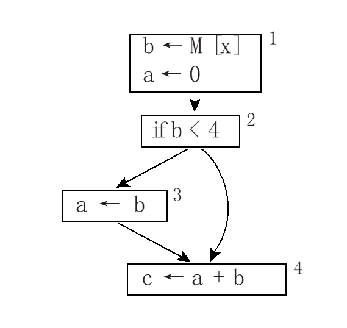
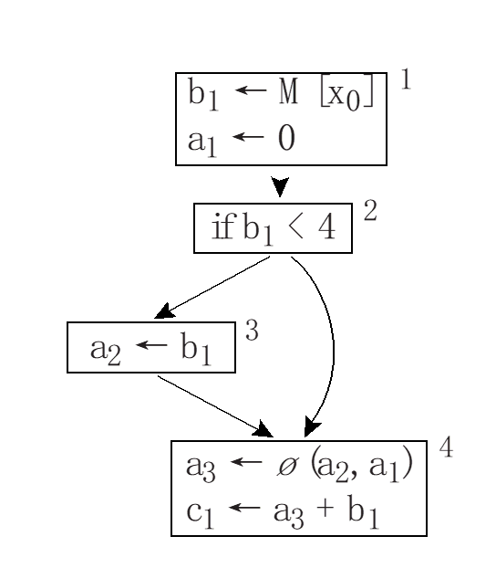

# Final Report


## 1、词法 & 语法分析

1、使用`Lexer`进行词法分析。代码在[`lexer.lex`](./src/lexer.lex)中。

简单地使用正则表达式匹配各个token并返回， 同时处理好`pos`信息，便于后续的报错。对于常数，用了一个`calc()`的辅助函数进行计算， 就是简单的遍历字符串转换为数字然后返回，由于常数不能有先导0，所以单独对0进行了处理。

注意对两种形式地注释进行处理。对于两种注释，分别进入`COMMENT1`和`COMMENT2`两个状态，在注释状态只需要处理`pos`信息即可。注意从注释状态退出，`//`的注释遇到换行符退出，`/*`的注释遇到`*/`退出。退出只需要回到`INITIAL`状态即可。

如果碰上非法的`token`， 则会打印出`Illegal input found at line x pos y`的错误信息，并且跳过它。

2、使用`yacc`进行语法分析。代码在[`parser.yacc`](./src/parser.yacc)中。

这里定义终结符即`Lex`中匹配的`token`和用于`CFG`推导的非终结符。

然后将简单地将FDMJ的语法规则加上，使用[`fdmjast.h`](./include/fdmjast.h)中提供的数据结构构建`AST`，根节点是定义在`main.c`中定义的`A_prog root`, 这里使用`extern`关键字访问它。即匹配上一条表达式或语句等的推导式，利用类似于`$$ = A_Exp($1, $2)`这样的语句进行语法树的构建和返回，`$$`类似返回值的意思，`$1`对应推导式中的第1个符号，`A_Exp()`是定义在[`fdmjast.h`](./include/fdmjast.h)中的构造函数，返回一个`A_exp`结构体的指针，最终处理完所有代码，给`root`赋值，整个`yyparse()`函数返回。

注意运算符优先级的处理。这里为了处理嵌套或不带`else`的`if`语句，给`IF`和`ELSE`也定义了优先级。

 语法错误时会输出`syntax error`，并结束整个程序。

3、在`main`函数中使用`yyparse()`调用整个词法&语法分析器。


## 2、语义分析

代码位于[`semantic.h `](./include/semantic.h) &  [`semantic.c`](./src/semantic.c)中。

1、语义分析阶段主要进行类型检查(type checking)，即检查所有使用的变量和常量类型是否正确(类似于等号两边的类型需要一致)，是否可赋值(即等号右边需要是右值)，是否可寻址(主要检查数组名或class指针进行访存或函数调用时是否正确)。

2、首先在[`types.h`](./include/types.h)和[`types.c`](./src/types.c)中定义了几种数据类型，包括`Ty_Int`(整型)、`Ty_Array`(数组)、`Ty_LocationInt`(有位置(即可赋值)的整型)、`Ty_Class`(class指针类型，其中记录了类名信息)等类型。

3、然后在[`table.h`](./include/table.h)和[`table.c`](./src/table.c)中实现了一个哈希表，在[`symbol.h`](./include/symbol.h)和[`symbol.c`](./src/symbol.c)中对他进行了一定的封装，用于这样一张`symbol`表记录变量名和类型的对应关系。

4、整个语义分析阶段的哈希表是如下的嵌套结构：

```
			 ...			      // 类名	         
			  ├── classEntry1    ├── id                
			  │					 |                 ├── type    // 变量类型
              |					 │// 类成员变量表    ├── varDecl // 变量在AST中被定义的结点
classTable ---├── classEntry2 ---├── varTable   ---├── offset  // 变量在类中偏移量										
			  │	                 │
			  |                  |// 类成员方法表
			  ├── classEntry3    ├── methodTable --├── localTable // 将方法中的局部变量映射到对应类型
			  									   ├── tempTable  // 将方法中的局部变量映射到临时变量temp(在转换成中间代码时有用)
			  									   ├── classEntry // 记录该方法所属的类
			  									   ├── classFrom  // 记录该方法来源的类(可能是从父类继承来的)
			  									   ├── returnType // 记录方法的返回值类型
			  									   ├── FormalList // 记录方法的参数列表 
			  									   ├── methodDecl // 方法在AST中被定义的结点
			  									   ├── offset     // 方法在类中的偏移量
			  									   ├── thisTemp   // 在转换成中间代码时有用
			  ...	
```

具体来说，就是全局有一张`classTable`, 它根据类名把类映射到对应的`classEntry`。

每个`classEntry`中记录了自身的类名，两张表`varTable`以及`methodTable`。

需要注意的是，`main`方法尽管不属于任何一个`class`,它也有一张属于自己的`methodTable`叫做`mainMethodTable`，作为全局变量被定义。

5、类型继承问题。定义了一张全局的`inheritTable`，将每个类和他的父类一一映射。

6、整个类型检查过程如下：

>1、初始化`classTable` , `mainMethodTable`和`inheritTable`。
>
>2、遍历`AST`，将所有的类和其对应的父类填入`inheritTable`
>
>3、使用`inheritTable`构建继承关系，同时使用DFS遍历所有的继承链，如果发现环则报告错误并退出程序。
>
>4、再遍历一遍`AST`解析类，对于每个类，如果他有父类， 则先递归进入解析其父类，并给父类打上标记。(避免遍历到父类时重复解析)。递归返回时，将整个父类的`classEntry`复制一份给自身。
>
>5、接着解析自身的变量和方法。
>
>6、解析变量时将变量名和对应类型填入`varTable`，解析方法时同样将对应信息填入`methodTable`。
>
>7、解析`method`就是遍历方法所对应的`AST`子树，将其中局部变量的定义和对应类型填入`localTable`，在使用该变量时从`localTable`中检查是否被定义以及类型是否正确，如果出现错误，则报告并退出程序。
>
>8、将解析好的自身的方法和变量加入从父类继承来的表，如果有重载则覆盖对应的`methodEntry`。
>
>9、最后解析`main`方法，和解析类的普通方法过程几乎一样。


## 3、翻译成中间代码(IR+)

代码位于[`translate.h `](./include/translate.h) &  [`translate.c`](./src/translate.c)中。

1、尽管我们可以直接将AST翻译成需要的机器码，但这样不利于可移植性和模块化设计。因此我们先将其转化为一种树形的中间代码，再由中间代码转化为对应的机器码(`risc-V`、`arm`等)。

2、在[`treep.h`](./include/treep.h)和[`treep.c`](./src/treep.c)中给出了这样一种树形结构的定义。

3、将`AST`转换为IR+只需遍历一遍`AST`并选择对应的树形结构进行转换，同时将变量由字符串标识符的形式转换为`temp: t100, t101`这样的形式。[`temp.h`](./include/temp.h)和[`temp.c`](./src/temp.c)中定义了`Temp`数据结构和使用的接口。

4、整个转换过程较为简单，下面说几点需要注意的情况：

> 1、条件变量。无论在中间代码还是机器码中，我们都没有这种类型。形如`a = b > 1;`这样的语句应该转换为 `if (b > 1) a = 1; else a = 0;`
>
> 2、短路逻辑，对于`&&` 和`||`这样的条件运算符，我们需要处理短路逻辑，使用`patchList`进行处理。具体来说就是，对于每一个操作数都给他加上`true`和`false`两个标签， 如果遇上短路逻辑，则直接跳转到对应的`true`或`false`标签所对应的语句，而不对后面的表达式继续进行运算。如果没有短路，那么把`true`和`false`置为NULL即可。
>
> 3、对于`while`和`if`这样带条件判断的语句，我们按照上面对条件变量的处理，然后将`true`和`false`标签填上循环体或跳出循环体的语句即可。
>
> 4、对于`continue`和`break`的判断，维护一个全局的栈。每次进入一个while循环，则在全局栈中压入新的循环体和退出循环体语句所对应的`label`，在遇到`continue`和`break`语句时，我们只需要从全局栈中查找需要跳转的位置即可，如果栈为空，则报告错误并退出程序。
>
> 5、数组变量。对于数组变量`arr`的定义和赋值。假定他的长度为`len`，我们先申请出`len + 1`的空间`pointer`，并在`pointer + 0`处记录下`len`，再将`pointer + 1`赋值给`arr`， 在调用`length(arr)`函数时，我们从`arr - 1`处获得数组长度并返回，在访问下标`arr[i]`时，我们将`arr + i`处的值返回。
>
> 6、`class`类型。对于`class`类型，在创建它时，我们需要申请出其成员数大小的空间，并将他的成员变量和方法依次填入该空间内。这样访问变量或调用函数时，我们只需要根据`class` + 偏移量即可找到。注意：这里的方法实质上是一个指针类型。
>
> 7、对于方法，我们需要在定义处加上一个参数`this`，用于作为方法对应的`class`指针， 在调用方法时，需要将该参数传进来。 


## 4、中间代码转换成基本块

代码位于[`canon.h `](./include/canon.h) &  [`canon.c`](./src/canon.c)中。

1、主要是将IR+中的ESEQ和CJUMP这样的非线性表达式转换为线性的`StmList`，然后再将其分成一个个`BasicBlock`。

2、删除ESEQ的方法，是将其中的SEQ语句提出来完成，并将最后的EXP作为返回值返回。

3、划分为基本块是按照`Label`进行划分，每一个`Label`对应一个基本块，并将条件分支的`false`分支所对应的基本块放在他的下方。


## 5、指令选择

分别对`rpi(树莓派) arm`和`llvm ir`两种"机器码"做了指令选择。

代码分别位于[`irp2rpi.h `](./include/irp2rpi.h) &  [`irp2rpi.c`](./src/irp2rpi.c) 和 [`codegen.h`](./include/codegen.h)和[`codegen.c`](./src/codegen.c)中。有关于机器码的基本数据结构实现在[`assem.h`](./include/assem.h)和[`assem.c`](./src/assem.c)中。

1、主要思路就是先对每种机器指令画出他能覆盖的所有树形中间代码，然后使用`Maximal Munch`算法寻找一种最佳覆盖。具体就是遍历上一步得到的基本块，对其中每个语句找到能覆盖它的最佳的机器指令。

2、对于每个语句我们都需要给出它的变量的`def`、`use`列表，以及涉及到的`Label`的`targets`列表，这个在后面做活跃分析时需要用到。

3、对于`llvm ir`需要注意的是，进行访存需要使用`ptr`类型而不是`int`类型，所有和访存有关的语句都需要先使用`inttoptr`指令转换后再做访存。

4、对于`arm`需要注意的是，进行函数调用时需要将参数存入`x0 ~ x3`寄存器，超过四个参数需要存入栈中。函数调用前需要添加保存`caller saved register`的指令，函数入口处需要添加保存`callee saved register`的指令，同时还要记得处理`fp, sp`指针。同时函数的返回值是保存在`x0`寄存器中的。

5、每个函数入口使用`prolog()`添加指令，出口使用函数`epilog()`添加指令，对于`llvm ir`, `prolog()`中只需要定义函数名和参数列表即可, `epilog()`只需要使用`ret`指令返回即可。`arm`则需要按第四点所说的进行一些处理。

6、两种"机器码"所对应的覆盖分别在[llvm ir tiles](./images/llvm_ir_tiles.png)和[arm tiles](./images/arm_tiles.png)中。


## 6、活跃分析

1、对每个`BasicBlock`进行活跃分析。代码位于[`liveness.h `](./include/liveness.h) &  [`liveness.c`](./src/liveness.c)中。

> 利用4中获得的`BasicBlock`和5中定义的`def` , `use`,  `targets`列表。
>
> 1、首先利用`targets`对于每个块找到它的能跳转到的块，即它的"子女块"以此来构建出数据流图。代码位于[`flowgraph.h`](./include/flowgraph.h)和[`flowgraph.c`](./src/flowgraph.c)， 有关图结构的基本定义在[`graph.h`](./include/graph.h)和[`graph.c`](./src/graph.c)中。
>
> 2、接着根据虎书上的数据流方程计算出每个块的`Liveness in`和`Liveness out`集合。
> $$
> \eqalign{
>   & in[n] = use[n]\bigcup {(out[n] - def[n])}   \cr 
>   & out[n] = \bigcup\limits_{s \in succ[n]} {in[s]}  \cr}
> $$
> 根据以上数据流方程(其中n代表数据流图中的一个结点)不断迭代，直到不发生改变为止，则计算出了整张图的活跃性。

2、计算冲突图。代码位于[`ig.h`](./include/ig.h)和[`ig.c`](./src/ig.c)中。

> 构建冲突图对于寄存器分配十分重要。如果两个变量的活跃范围发生重叠，则二者冲突，则他们在冲突图中由一条冲突边。
>
> 构建冲突图的过程较为简单，只需要遍历所有`BasicBlock`的活跃集合，将冲突的变量直接加上边即可。


## 7、静态单赋值形式(SSA)

代码位于[`ssa.h `](./include/ssa.h) &  [`ssa.c`](./src/ssa.c)中。

静态单赋值形式即指汇编代码中的一个临时变量只被赋值一次。这种形式的代码有利于许多编译优化的实现，也只有这种形式的`llvm ir`代码才能够被运行。

实现静态单赋值形式的代码主要思路是，将被赋值多次的变量重命名为不同名字的变量，同时对这些变量的使用也需要对应修改。具体使用phi函数实现。如下图所示：



1、实现`SSA`涉及到大量集合求交求并的操作，因此，我使用了类似于`Bitmap`的形式来维护每个变量或结点的存在与否。通过增加空间复杂度，大大减少了时间复杂度。

2、首先我们需要对数据流图计算出必经结点树，利用虎书上的18.1.1节的方程进行迭代计算不动点。其中`s0`为根节点。
$$
\eqalign{
  & {\rm{D}}[{s_0}] = \{ {s_0}\}   \cr 
  & D[n] = \{ n\} \bigcup {(\bigcap\limits_{p \in pred[n]} {D[p]} )}  \cr}
$$

> 一个结点的必经结点是从根节点到它所必须经过的结点。
>
> 一个结点所有必经结点同时是它的直接必经结点的必经结点。

以上两句话给出了必经结点和直接必经结点的定义，我们根据该方程计算出来的必经结点树中每个结点的双亲结点就是它的直接必经结点。

由于使用了`Bitmap`对D这个数据集合进行维护，以上方程的计算十分简单。

3、接着我们需要计算出必经结点边界。结点`x`的必经结点边界是所有符合下面条件的结点`w`的集合:`x`是`w`前驱的必经结点，但不是w的必经结点。

利用虎书19.1.2节的伪代码实现必经结点边界的计算。

4、插入`phi`函数, 利用虎书算法19-1实现`phi`函数的插入，这里需要遍历所有的`BasicBlock`在每个基本块的开头插入对应的`phi`函数。

5、变量重命名，利用虎书算法19-2实现变量重命名。

6、转换为`ssa`形式的`llvm ir`代码在`main`函数中打印出来后已经可以通过`lli`指令运行了。


## 8、寄存器分配

代码位于[`regalloc.h `](./include/regalloc.h) &  [`regalloc.c`](./src/regalloc.c)中。

1、对指令选择阶段生成的`arm`指令做寄存器分配。可供我们分配的寄存器为`r0 ~ r7`共8个，`r8 ~ r10`预留出来供溢出的变量使用，`fp sp lr`作为特殊寄存器不用于分配。

2、其中`r0 ~ r3`是`caller saved registers`，需要在调用函数前进行保存，处理方法是将他们同时填入调用函数指令的`def`和`use`列表。这样在做寄存器分配的时候就会自动避开他们，或者使用前先进行保存。

`r4 ~ r10`是`callee saved registers`，需要被调用者保护，处理方法是在函数入口处即`prolog()`函数处将所有的`callee saved registers`压入栈中保存，在函数返回时将他们全部弹出栈进行恢复。

3、仅使用简化和溢出两个步骤做寄存器分配，而不是按虎书上的所有步骤进行。

4、简化阶段，维护一个简化栈。不断遍历冲突图，对于度数小于8的结点，我们则将其加入简化栈中(因为它的度数小于8，和少于8个变量冲突，则它一定能被分配到寄存器)，并对该结点进行标记，之后计算度数时不再算它，这一阶段称为简化。

5、溢出阶段。若没有可以被简化的结点，则进入溢出阶段，将图中度数最大的结点删去，并加入简化栈。然后回到简化阶段，这一阶段称为溢出。

6、染色。将简化栈中的结点一个个弹出，为其分配一个合适的寄存器(它的所有邻居都没有使用的寄存器)。如果是不能被分配到一个寄存器，则我们在栈中为它分配一个位置。并且在所有定义该变量的指令后面加上一句将其存入栈上对应位置的指令，在所有使用该变量的语句前加上一句将其从栈中取出来至寄存器(我们预留的`r8 ~ r10`寄存器，由于一条指令至多有三个操作数，所以预留三个寄存器就足够了)。整个染色阶段，我们需要维护一张哈希表，用于记录变量所对应的寄存器或者变量在栈中的对应位置。

7、生成最终的汇编代码时，我们只需要在打印时，根据变量名从哈希表中找到它对应的寄存器然后将指令改写即可。

## 9、MAIN函数

代码位于[`main.c `](./main.c)中。

1、首先将调用`yyparse()`对fdmj源代码进行词法分析和语法分析。`lex`默认从标准输入读入数据，需要进行重定向。

2、接着调用[`semantic.h `](./include/semantic.h)提供的`check_Prog()`进行类型检查。如果出错会直接报告错误并结束程序。

3、然后调用[`translate.h `](./include/translate.h) 提供的`translate_Prog()`将`AST`转化为中间代码。

4、再调用[`canon.h `](./include/canon.h)提供的`C_linearize()`和`C_basicBlocks()`函数生成基本块。

5、对于`rpi arm`和`llvm ir`分别调用[`irp2rpi.h `](./include/irp2rpi.h)和  [`codegen.h`](./include/codegen.h)提供的`codegen()`函数进行指令选择。

6、完成活跃分析之后，对`llvm ir`代码转化为`SSA`的形式， 对`rpi arm`做寄存器分配，这样最终生成出来的代码都是可以运行的。

## 10、运行方式

见[`README.md`](./README.md)
